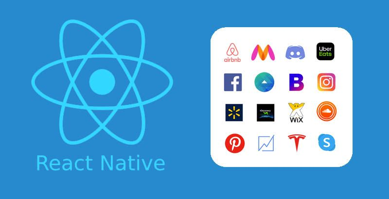
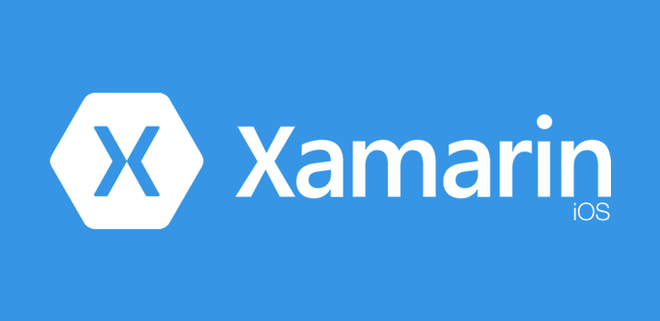
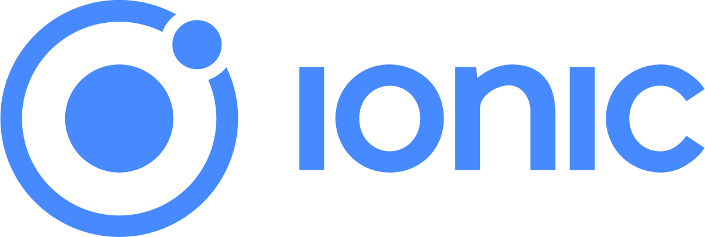
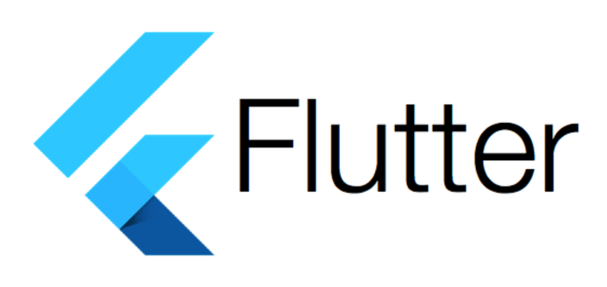

# Cross Platforms

## Table Of Content
<!-- TOC -->

- [Cross Platforms](#cross-platforms)
  - [Table Of Content](#table-of-content)
    - [What Does cross platforms mean?](#what-does-cross-platforms-mean)
    - [Why is it important to be cross-platform?](#why-is-it-important-to-be-cross-platform)
    - [Is a Cross-Platform Approach Suitable for Development of Your App?](#is-a-cross-platform-approach-suitable-for-development-of-your-app)
      - [Cross-platform app development is a choice when](#cross-platform-app-development-is-a-choice-when)
      - [Considering native app development makes sense if you want an app:](#considering-native-app-development-makes-sense-if-you-want-an-app)
    - [5 Frameworks for Cross-Platform App Development](#5-frameworks-for-cross-platform-app-development)

<!-- /TOC -->

### What Does cross platforms mean?

A cross-platform computer product or system is a product or system that can work across multiple types of platforms or operating environments.

In computing, cross-platform (also multi-platform) refers to different computing platforms (Windows, iOS, Android, macOS, Linux) or even device types (desktops, mobile).

### Why is it important to be cross-platform?

It’s important to have or use a product that is cross-platform so that it can work with a wide variety of devices. If security keys are cross-platform a user can use one key across all their devices.

### Is a Cross-Platform Approach Suitable for Development of Your App?

This question appears naturally but there is no definite answer. It depends on your goals.

#### Cross-platform app development is a choice when

- your goal is to appear on the market ASAP;
- you aren’t sure about the success of your idea and want to test it with the least amount of effort on your part;
- your primary goal lies in reaching out to a larger audience;
- you are limited in resources (time, money, human resources);
- you have a website and want to wrap it up into an app with minimal costs;

the application doesn’t involve complex animation and doesn’t deal with calculations.

#### Considering native app development makes sense if you want an app:

- to have free access to all device’s resources and services;
- to make the most of the device hardware;
- to be as responsive as possible.

Still, no article will offer a universal solution. It’s an experienced developer, who will be able to weigh all pros and cons of the cross-platform app development for each special case.

So, if you are at a crossroads, don’t hesitate to ask Fulcrum developers for advice. And if this approach is for you, we will gladly get down to business and come up with a splendid app for you! 🙂

### 5 Frameworks for Cross-Platform App Development

Regardless of your role in app development, knowing which tools facilitate the process would be nice, wouldn’t it?

Let’s have a look at 5 frameworks that are worth your attention.

- #### React Native: Learn Once, Write Anywhere
    - .

React Native is an open-source mobile app development platform created by Facebook. It is used by such giants as Instagram, Facebook, Walmart, Tesla, Pinterest, UberEats.

Its primary goal lies in making a cross-platform app as stable and productive as a native one. “Learn once, write anywhere” is its main principle.

The good point is that the process of layout creation works the same way for mobile screens and web page layout. Interaction of components with each other is flexible and easy.

Hot Reloading feature allows adding a new code and making edits right at runtime. It’s indeed useful when you customize the user interface. The framework comes with a large set of ready-made components but they don’t always adapt to different platforms. It leads to additional adjustments in the code. An extensive community offers a rich selection of third-party libraries though.

- #### Xamarin: Trusted by Enterprise
    - .

Xamarin is Microsoft’s mobile app development platform. With Xamarin you can create applications for Windows, iOS, and Android using a single .net code. To discover its potential, check out such apps as Olo, The World Bank, Storyo.

The framework is equipped with Xamarin.Android/iOS. It brings capabilities and interface of cross-platform applications closer to the native. Xamarin.Forms, in turn, helps to speed up the coding process. Almost all elements of this simple tool are 100% compatible with any platform.

Also, Xamarin provides

- a user-friendly interface
- a full development cycle
- many other handy tools such as debugging, UI design tools, etc.

- #### Ionic
    - 

Ionic allows creating cross-platform hybrid applications for iOS and Android. It works closely with the Apache Cordova framework. It transforms web applications into mobile programs. The framework supports JavaScript, Angular, Vue, and React.

Ionic seems pretty similar to React Native but the conception of the single code for different platforms is realized on a new level. All of the framework’s components adapt automatically to one or another platform and it speeds up the development.

Ionic is built on ECMAScript 6 and TypeScript, which means compatibility with any IDE.

Its weak side though lies in a low speed and performance because instead of native components, it uses web technologies.  On the other hand, it allows quick testing right in a browser.

- #### Flutter
  
  
  * - ["Did You Know About Dart?"](./Dart.md)
  
  
    - 

This open-source framework was created by Google. Flutter is capable of delivering high performance across iOS, Android, Windows, macOS, and the Web using a single codebase.

Creating splendid interfaces with Flutter is not a big deal, especially if you know C++ or Java. It has a Hot Reloading feature and a large set of ready-made widgets. They take into account existing platform differences:

page scrolling
navigation
icons, and fonts
Still, creating different styles for different OS sounds like a lot of work. Flutter uses its own graphics engine instead of native components. There is no automatic adaptation for these purposes.

Flutter shows the highest performance due to the modern Dart language and its rendering engine.

- #### PhoneGap: apps powered by open web tech

PhoneGap is an example of a web technologies application in mobile development.

PhoneGap apps are often lightweight because they represent a set of HTML pages wrapped in a native shell. Pages are stored in a local directory or the cloud. When launched on a smartphone, they access device functionality through plugins. It does affect the overall look of the app and the quality of the user interface will largely depend on the web presentation of a specific OS.

* Compared to native tools, this framework has a low performance.
